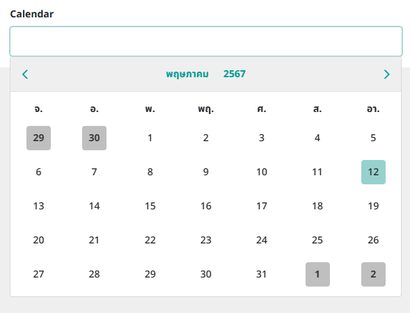

## react-js-calendar-th 🕘

This Calendar TH component  
```
npm install react-js-calendar-th
```

## Example 
```js
import { Calendar } from 'react-js-calendar-th';

console.log(getYearList());     //  return '2556-2576' //current year +- 10
console.log(getYearList(2560,2570));     //  return '2560-2570'
console.log(getYearList(2020,2030));     //  return '2563-2573'

// return format
[
  { value : 2560, label : 2560, revalue : 2017 },
  { value : 2561, label : 2561, revalue : 2018 },
  ...
  { value : 2570, label : 2570, revalue : 2027 },
]

```


## Format 
