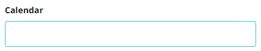
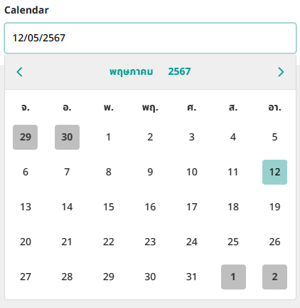
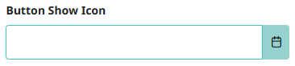
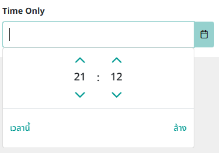
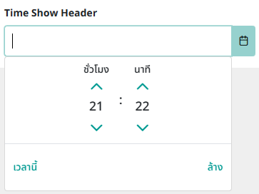

## react-js-calendar-th 🕘

This Calendar TH component  
```
npm install react-js-calendar-th
```

## Example 
```js
import { Calendar } from 'react-js-calendar-th';

//If you use primereact, there is no need import this css
import 'react-js-calendar-th/dist/css/Calendar.css'
import 'react-js-calendar-th/dist/css/main.css'

const [date, setDate] = useState(null);

return (
    <Calendar
        value={date}
        onChange={(e) => setDate(e.value)}
        locale="th"
        dateFormat = "dd/mm/yy"
    />
)

```



```js
<Calendar value={date} onChange={(e) => setDate(e.value)} locale="th" showButtonBar />
```


```js
<Calendar value={date} onChange={(e) => setDate(e.value)} locale="th" showButtonBar showIcon />
```


```js
<Calendar value={date} onChange={(e) => setDate(e.value)} locale="th" showButtonBar showIcon timeOnly />
```


```js
<Calendar value={date} onChange={(e) => setDate(e.value)} locale="th" showButtonBar showIcon timeOnly showHeaderTime />
```

